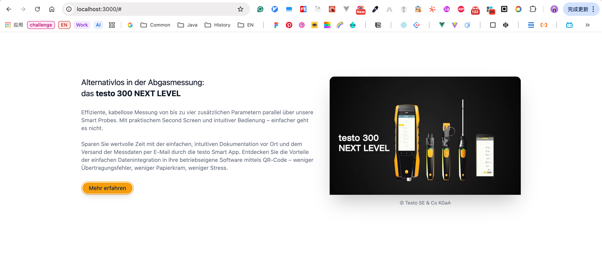

# Testo-Code-Challenge

- [Testo-Code-Challenge](#testo-code-challenge)
  - [(1) Carousel](#1-carousel)
    - [1.0 CodeSandbox/open-browser's-console](#10-codesandboxopen-browsers-console)
    - [1.1 Carousel implementation - `Only scrolling right.`](#11-carousel-implementation---only-scrolling-right)
    - [1.2 Carousel implementation - `Scrolling left and right.`](#12-carousel-implementation---scrolling-left-and-right)
    - [1.3 Requirements:](#13-requirements)
  - [(2) Image-Text-Section](#2-image-text-section)
    - [2.1 Image-Text-Section repository link](#21-image-text-section-repository-link)
    - [2.2 Storyblok](#22-storyblok)
    - [2.3 Effect](#23-effect)
  - [English](#english)
    - [(1) 2025-08-25](#1-2025-08-25)
    - [(2) 2025-08-28](#2-2025-08-28)

```
Testo-Code-Challenge
├─ (1) Carousel
│  ├─ 1.0 CodeSandbox/open-browser's-console link.
│  ├─ 1.1 Carousel implementation - Only scrolling right.
│  ├─ 1.2 Carousel implementation - Scrolling left and right.
│  │   └─ Requirements
│  └─ UI Mockup
│      ├─ effect-left
│      └─ effect-left-right
│
├─ (2) Image-Text-Section
│  └─ repository-link + UI Mockup
│
├─ English
│  ├─ (1) 2025-08-25
│  └─ (2) 2025-08-28
```

## (1) Carousel

### 1.0 [CodeSandbox/open-browser's-console](https://codesandbox.io/p/sandbox/testo-code-challenge-4mw95f)

### 1.1 Carousel implementation - `Only scrolling right.`

```ts
type ScrollResult = {
  internalIndex: number;
  needsJump: boolean;
  jumpToIndex?: number;
};

/**
 * @param banners - an array of strings representing the real banners (length ≥ 2)
 * @param scroll - an integer representing how many times the user has scrolled right (0 <= scroll <= 100)
 * @returns the internal index in the augmented list, and jump behavior if on a cloned item
 */

// Thinking
// 1.
// Special Case:
// - Description: Scroll 0 time is a special case, so we need to handle it separately.
// - Why: Because when the number of scroll times more than 1 loop, Both  "scroll%len" and "0%len" are equal to 0.
// 2.
// Jump:
// - Question: In which situation do we need to jump?
// - Answer: If original list is 'ABC', when we scroll 3 times, we reach "ABC[A]", so we need to jump to "A".
// - Reverse Thinking: When "scroll%len===0", at this time we reach the first banner in "original list", we need to jump to last banner in "augmented list".
// 3.
// Except 12: we can get internalIndex using "(scroll%len) + 1" and we don't need jump.
// 4.
// boundary
// internalIndex: 1 ~ original list length + 1
// 5.
// Concept
// - cloned item.
// - real item.
// - internalIndex.

export function simulateScroll(banners: string[], scroll: number): ScrollResult {
  const len = banners.length;

  if (scroll === 0) return { internalIndex: 1, needsJump: false };

  if (scroll % len === 0) return { internalIndex: len + 1, needsJump: true, jumpToIndex: 1 };

  return { internalIndex: (scroll % len) + 1, needsJump: false };
}

// Test Case:
/** 1
//  const result0 = simulateScroll(["A", "B", "C"], 0);
//  const result3 = simulateScroll(["A", "B", "C"], 3);
//  const result4 = simulateScroll(["A", "B", "C"], 4);
//  const result5 = simulateScroll(["A", "B", "C"], 5);
//  const result6 = simulateScroll(["A", "B", "C"], 6);
// App.js:11 0 {internalIndex: 1, needsJump: false}
// App.js:12 3 {internalIndex: 4, needsJump: true, jumpToIndex: 1}
// App.js:13 4 {internalIndex: 2, needsJump: false}
// App.js:14 5 {internalIndex: 3, needsJump: false}
// App.js:15 6 {internalIndex: 4, needsJump: true, jumpToIndex: 1}
*/
/** 2
//  const resultD0 = simulateScroll(["A", "B", "C", "D"], 0);
//  const resultD1 = simulateScroll(["A", "B", "C", "D"], 1);
//  const resultD2 = simulateScroll(["A", "B", "C", "D"], 2);
//  const resultD3 = simulateScroll(["A", "B", "C", "D"], 3);
//  const resultD4 = simulateScroll(["A", "B", "C", "D"], 4);
//  const resultD5 = simulateScroll(["A", "B", "C", "D"], 5);
//  const resultD6 = simulateScroll(["A", "B", "C", "D"], 6);
//  const resultD7 = simulateScroll(["A", "B", "C", "D"], 7);
//  const resultD8 = simulateScroll(["A", "B", "C", "D"], 8);
// App.js:26 D0 {internalIndex: 1, needsJump: false}
// App.js:27 D1 {internalIndex: 2, needsJump: false}
// App.js:28 D2 {internalIndex: 3, needsJump: false}
// App.js:29 D3 {internalIndex: 4, needsJump: false}
// App.js:30 D4 {internalIndex: 5, needsJump: true, jumpToIndex: 1}
// App.js:31 D5 {internalIndex: 2, needsJump: false}
// App.js:32 D6 {internalIndex: 3, needsJump: false}
// App.js:33 D7 {internalIndex: 4, needsJump: false}
// App.js:34 D8 {internalIndex: 5, needsJump: true, jumpToIndex: 1}
*/
```

### 1.2 Carousel implementation - `Scrolling left and right.`

```ts
// -------
// 2
// Scrolling left and right.
// -
// C ABC A
// simulateScroll(["A", "B", "C"], 0, 'left');
// 0 scrolling. { internalIndex: 1, needsJump: false }
// 1 scrolling. { internalIndex: 0, needsJump: true, jumpToIndex: 3 }
// 2 scrolling. { internalIndex: 2, needsJump: false }
// 3 scrolling. { internalIndex: 1, needsJump: false }
// 4 scrolling. { internalIndex: 0, needsJump: true, jumpToIndex: 3 }
// 5 scrolling. { internalIndex: 2, needsJump: false }
// 6 scrolling. { internalIndex: 1, needsJump: false }
// 7 scrolling. { internalIndex: 0, needsJump: true, jumpToIndex: 3 }
// -
// D ABCD A
// simulateScroll(["A", "B", "C", "D"], 0, left);
// 0 scrolling. { internalIndex: 1, needsJump: false }
// 1 scrolling. { internalIndex: 0, needsJump: true, jumpToIndex: 4 }
// 2 scrolling. { internalIndex: 3, needsJump: false }
// 3 scrolling. { internalIndex: 2, needsJump: false }
// 4 scrolling. { internalIndex: 1, needsJump: false }
// 5 scrolling. { internalIndex: 0, needsJump: true, jumpToIndex: 4 }
// 6 scrolling. { internalIndex: 3, needsJump: false }
// 7 scrolling. { internalIndex: 2, needsJump: false }
export function simulateScroll2(banners: string[], scroll: number, direction: "left" | "right"): ScrollResult {
  const len = banners.length;

  if (direction === "right") {
    if (scroll === 0) return { internalIndex: 1, needsJump: false };
    if (scroll % len === 0) return { internalIndex: len + 1, needsJump: true, jumpToIndex: 1 };
    return { internalIndex: (scroll % len) + 1, needsJump: false };
  }

  if (direction === "left") {
    if (scroll === 0) return { internalIndex: 1, needsJump: false };
    const mod = scroll % len;
    if (mod === 1) return { internalIndex: 0, needsJump: true, jumpToIndex: len };
    if (mod === 0) return { internalIndex: 1, needsJump: false };
    return { internalIndex: len - mod + 1, needsJump: false };
  }

  return { internalIndex: 1, needsJump: false };
}
const res_0 = simulateScroll2(["A", "B", "C", "D"], 0, "left");
const res_1 = simulateScroll2(["A", "B", "C", "D"], 1, "left");
const res_2 = simulateScroll2(["A", "B", "C", "D"], 2, "left");
const res_3 = simulateScroll2(["A", "B", "C", "D"], 3, "left");
const res_4 = simulateScroll2(["A", "B", "C", "D"], 4, "left");
const res_5 = simulateScroll2(["A", "B", "C", "D"], 5, "left");
const res_6 = simulateScroll2(["A", "B", "C", "D"], 6, "left");
const res_7 = simulateScroll2(["A", "B", "C", "D"], 7, "left");
console.log("res_0: ", res_0);
console.log("res_1: ", res_1);
console.log("res_2: ", res_2);
console.log("res_3: ", res_3);
console.log("res_4: ", res_4);
console.log("res_5: ", res_5);
console.log("res_6: ", res_6);
console.log("res_7: ", res_7);
```

### 1.3 Requirements:

```
Question:

Part 1: Problem-solving
Problem: Simulate Infinite Scroll Indexing.
In a banner carousel, we want to simulate infinite scrolling by cloning the first and last banners and inserting them at the beginning and end of the banner list.

For example, if the original list is:
["A", "B", "C"]
And the augmented list is:
["C", "A", "B", "C", "A"]

The carousel starts at index 1, which is the first real item ( "A" ).
When scrolling right (forward), the internal index increases.In the real front-end banner component, the scroll to the cloned banner A is animated, and followed by an instant jump to the real A, creating an illusion of infinite scrolling.
```


## (2) Image-Text-Section

### 2.1 Image-Text-Section repository link

[Requirement:Image-Text-Section/repository-link](https://github.com/DevOpsESolutionTesto/frontend-coding-challenge)

[Implementation:Image-Text-Section/repository-link](https://github.com/woow-wu7/8-testo-frontend-coding-challenge)

### 2.2 Storyblok

```
1
create new Space. // research

2
create new Story. // testo
- slug: // ------------------------ 'slug' as an 【 identifier 】 in URL.
- contentType: default-page // ---- So, you need to create a component in your project.
- then will enter in the editing page to see changes in real-time.
- then you can according your preference to configure your page.

3
access-token
- setting -> Access-Token
- // Public
- // Preview


4
preview
- https
- tutorial: https://www.storyblok.com/tp/add-a-headless-cms-with-live-preview-to-qwik-in-5-minutes
```

### 2.3 Effect




## English

### (1) 2025-08-25

```
1
carousel 旋转木马 n
roller coaster. 过山车 n
cup coaster. 杯垫 n
-
【 // roller coaster. 过山车 n 】
【 // cup coaster. 杯垫 n 】
【 coaster 杯垫 n 】
【 toaster 烤面包机 n 】
-
1.1
He plans to 【 ride 】 the 【 carousel 】 first, 【 followed by 】 the 【 roller coaster 】.
他准备先坐旋转木马，紧接着坐过山车
// -- 【 followed by. 紧接着 】
-
1.2
There are 【 roller coaster 】 and 【 carousel 】 models placed on the 【 cup coaster 】.
杯垫上放着过山车和旋转木马模型
// -- 【 cup coaster. 杯垫 n 】
// -- 【 roller coaster. 过山车 n 】


2
【 tackle 应付 解决 v 】
【 tack 大头钉 图钉 n / 钉上 v 】
【 pin 大头针 别针 钢钉 钢针 n / 钉住 别住 v 】
-
【 // tackle the task. 解决任务 v 】
【 // tackle the problem. 解决问题 v 】
-
【 // sticky note. 便签 n 】
【 // discard illusion. 丢弃幻想 v 】 VS 【 face reality. 面对现实 v 】
【 // face reality. 面对现实 v 】
-
discard. = abandon. 丢弃 v
tackle = handle = solve = resolve = deal with. = [address-地址n-解决v]. 解决 应付 处理 v
-
2.1
He is preparing to 【 tack / pin 】 the 【 sticky notes 】 to the wall with 【 tacks 】, and there are tasks that we need to 【 tackle 】 on the sticky notes.
他准备把便签纸用大头钉钉在墙上，便签纸上有我们需要解决的任务
// -- 【 sticky notes. 便签 n 】
// -- 【 tack VS tackle VS pin 】
-
2.2
Please 【 discard illusions 】 and 【 tackle 】 the task immediately.
请丢弃幻想，立即着手处理这项任务


3
【 illusion 幻想 错觉 n 】
【 reality 现实 n 】
【 reliable 可靠的 adj 】
【 relative 相对的 adj / 亲戚 n 】
-
【 // discard illusion. 丢弃幻想 v 】
【 // face reality. 面对现实 v 】
-
3.1
Please 【 discard illusions 】 and 【 tackle 】 the task immediately.
请丢弃幻想，立即着手处理这项任务
```

### (2) 2025-08-28

```
1
followed by. 紧接着是... 接下来是...
-
【 flow 流动 流淌 v / 流 n 】
【 follow 跟随 沿着 v 】
【 following 下列的 adj 】
inflow 流入 n
outflow 流出 n
overflow 溢出 v n
workflow 工作流 n
data flow. 数据流 n
cash flow. 现金流 n
flowchart 流程图 n
flow out. 流出 v
// follow up. 跟进 v
// follow-up. 后续的 adj
// follow-up process. 后续流程 n
// followed by. 紧接着是... 接下来是...
-
【 A, followed by B. 】 = 【 A, and then B 】
-
cash VS cache
-
1.1
He is using the 【 flowchart 】 to describe the inflows and outflows of the 【 data flow 】 and 【 cash flow 】.
他正在用流程图描述流入和流出的数据流和现金流
-
1.2
Please 【 follow up 】 the 【 follow-up process 】 according to the 【 following 】 demands.
请根据以下要求，跟进后续流程
-
1.3
He plans to ride the 【 carousel 】 first, 【 followed by 】 the 【 roller coaster 】.
他准备先坐旋转木马，紧接着坐过山车


2
【 retrieve 检索 获取 取回 v 】
-
【 // retrieve database. 检索数据库 v 】
【 // retrieve data. 检索数据 v 】
-
【 // retrieve data. 获取数据 v  】
-
2.1
We need to 【 retrieve 】 the 【 database 】 first, and then 【 retrieve 】 data through the API.
我们需要先检索数据库，再通过 API 获取数据


3
【 further 更多的 adj / 更远地 adv 】
-
【 // further information. 更多的信息 n 】
【 // look further ahead. 展望地更远 v 】
【 // look forward to sth. 期待某事 v 】
-
3.1
We 【 look forward to 】 your 【 looking further ahead 】 and obtaining 【 further information 】.
我们期待你能展望地更远，获得更多的信息
// -- look forward to your response.
// -- look ahead. 展望 v
// -- look further ahead. 展望地更远 v
// -- further information. 更多信息
```
